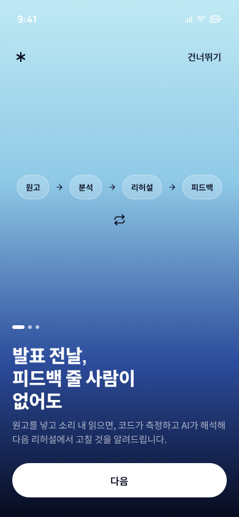
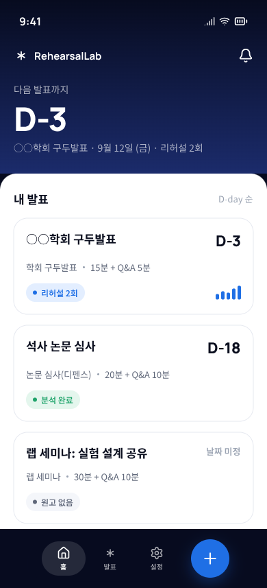
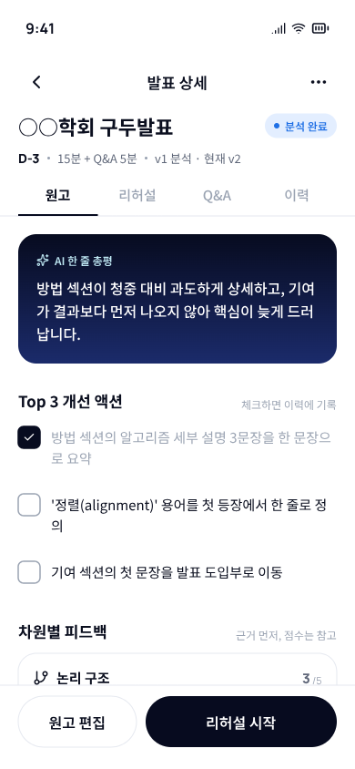
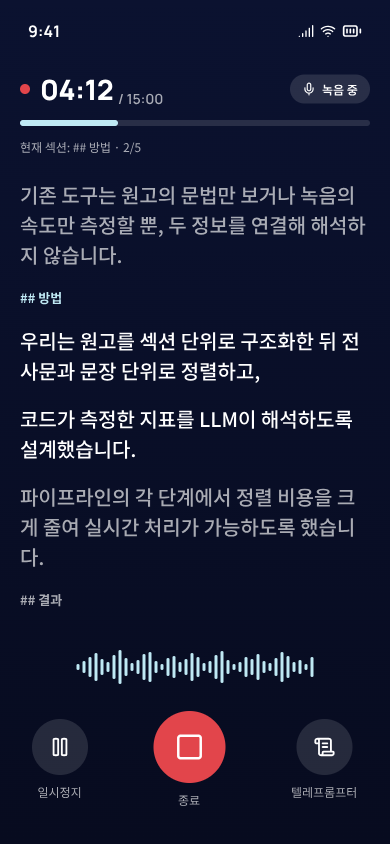
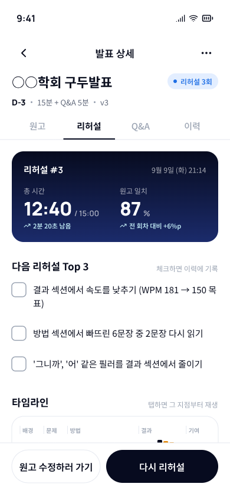
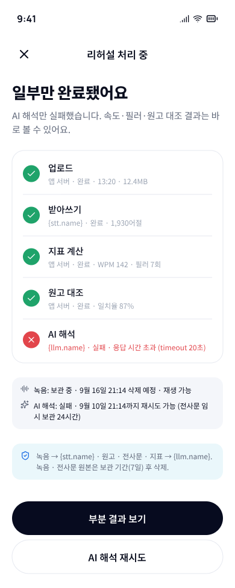

# RehearsalLab

**발표 전날, 피드백 줄 사람이 없어도.**
학술 발표 원고를 넣고 소리 내 읽으면, 코드가 속도·군말·원고 일치율을 측정하고 LLM이 근거와 함께 해석해 "다음 리허설에서 고칠 것"을 알려주는 Flutter 앱입니다.

> An LLM-based rehearsal coach for academic talks: paste your script, record a run-through, and get evidence-first, multi-dimensional feedback that loops back into the script.

| | |
|---|---|
| 대상 | 학회 구두발표 · 논문 심사(디펜스) · 랩 세미나를 준비하는 대학원생 |
| 형태 | Flutter 모바일 앱 (Android · iOS), 1인 프로토타입 |
| 상태 | 디자인 완료 → **구현 진행 중** (앱 뼈대 완성, 화면 구현 단계) |

---

## 무엇을 하는 앱인가

앱은 하나의 루프를 돌리는 도구입니다.

```
원고 준비 → 원고 분석 → 리허설 녹음 → 리허설 리포트 → (원고 문제면 원고 수정 / 전달 문제면 다시 리허설) → Q&A 연습 → 발표 당일
```

| 단계 | 사용자가 하는 것 | 앱이 주는 것 |
|---|---|---|
| 원고 분석 | 원고를 붙여넣고 "원고 분석" | 한 줄 총평, Top 3 개선 액션, 논리 구조·명료성·청중 적합성 카드(근거 인용이 점수보다 먼저), **리라이트 제안**(원문 → 수정문 → 이유, 한 번에 원고 반영), 섹션별 예상 시간 vs 규격 |
| 리허설 녹음 | 텔레프롬프터를 보며 소리 내 읽기 | 3초 카운트다운, 일시정지·자동 종료(20분), 종료 확인 |
| 리허설 리포트 | 리포트를 읽고 구간을 탭해 자기 목소리 듣기 | 총 시간 vs 규격, 원고 일치율(전 회차 대비), 속도(WPM)·필러·침묵 타임라인, 섹션별 시간 배분, **원고 대조 뷰**(읽음·빠뜨림·즉흥 추가·순서 바뀜), 6차원 피드백 |
| 반복 | Top 3 체크 → 다시 리허설 또는 원고 수정 | 원고 버전(v1 → v2 → v3)과 회차별 변화 추적 |

설계 원칙: 다음 행동이 항상 하나 보인다 · 근거가 점수보다 먼저 · 모든 지점은 소리로 확인할 수 있다 · 부분 실패는 부분 결과로 · 원고와 피드백을 떼지 않는다 · 처음 5분 안에 리포트를 본다 · 개인정보는 매 단계에서 통제감을 준다.

## 화면 미리보기

| 온보딩 | 홈 | 원고 분석 완료 |
|---|---|---|
|  |  |  |

| 녹음 | 리허설 리포트 | 처리 부분 실패 |
|---|---|---|
|  |  |  |

디자인 언어: 딥 네이비 → 아이스 블루 그라데이션, 흰 라운드 카드, 큰 숫자, 캡슐형 하단 탭바 (Manrope · Noto Sans KR · lucide 아이콘).

---

## 프로젝트 구조

```
lib/
├── main.dart              # ProviderScope + MaterialApp.router
├── app/                   # 라우터(AppPage enum · go_router) · 테마(토큰 → AppColors/AppSpacing/AppTheme) · 문구 상수 · 앱 설정
├── core/                  # enum · extension · Result<T>
├── models/                # 발표 · 원고 버전 · 원고 분석 · 리허설 · 리포트 · 동의 기록 · 제공사 설정 (수동 직렬화)
├── services/              # 로컬 저장 · 원고 추정/분석 · 리라이트 · 녹음 · 재생 · 받아쓰기 · 지표 · 정렬 · AI 해석 · 처리 파이프라인 (추상 + Mock)
├── features/              # 기능별 Riverpod provider
└── ui/
    ├── common/            # 공용 위젯 (버튼 · 칩 · 배지 · 카드 · 헤더 · 하단 바 등)
    └── pages/             # 화면 단위 페이지
assets/
├── providers.json         # 음성인식 · AI 제공사 표시 정보 (비밀키 없음)
└── sample/                # 샘플 원고
test/                      # 모델 직렬화 · 서비스 계산 · 공용 위젯 테스트
```

layer-first + feature 폴더 구조입니다. 파일명은 snake_case, import는 항상 `package:rehearsallab/...`.

## 기술 스택

| 영역 | 선택 |
|---|---|
| 프레임워크 | Flutter 3.41 · Dart 3.11 |
| 상태 관리 | flutter_riverpod 3 (코드젠 없음) |
| 라우팅 | go_router (`AppPage` enum) |
| 디자인 → 코드 | 디자인 토큰 → `AppColors` / `AppSpacing` / `AppTheme`, 디자인 컴포넌트 → `ui/common` 위젯 1:1 |
| 오디오 | record · just_audio · permission_handler |
| 외부 AI | 음성인식(STT) · LLM 제공사는 `assets/providers.json`으로 주입, 미지정 시 전송 차단 |
| 저장 | 로컬 JSON(path_provider) · shared_preferences. 녹음·전사문은 보관 기간(7일/30일/즉시) 적용 |

## 실행

```bash
flutter pub get
flutter run                            # 기기/에뮬레이터 (기본 mock 모드)
flutter run --dart-define=APP_MODE=live # 실서비스 모드 (providers.json이 비어 있으면 전송 차단)
flutter test
```

- **mock 모드**(기본): 외부 요청 없이 데모 데이터로 전체 루프(원고 분석 → 녹음 → 처리 → 리포트)를 돌려 볼 수 있습니다. 화면 우상단에 "개발용 목업" 배지가 보입니다.
- **live 모드**: `assets/providers.json`에 제공사 정보가 있고 프라이버시 동의가 최신일 때만 외부로 전송합니다.
- 해상도: 320 · 390 · 430 logical px 폭에서 오버플로 없이 동작하도록 설계했습니다.

## 개인정보

원고·녹음은 외부 음성인식·LLM 제공사로 전송됩니다. 제공사명, 전송 범위, 보관 기간, 삭제 상태를 앱 안에서 항상 볼 수 있게 설계했으며, 녹음·전사문 원본은 선택한 보관 기간 후 삭제되고 원고·리포트는 직접 삭제 전까지 유지됩니다. 실제 제공사는 배포 전 `providers.json`으로 확정합니다.
